# Machine Learning
## Artificial Intelligence
  Creation of machines which mitigates (or) mimics the human intelligence.

##  Machine Learning
   It is a subset of AI which is used to train machine by feeding large amount of data without explicit programming.

## Deep learning
 It is a subset of AI and ML which uses artificial neural networks to train model with huge amount of data.

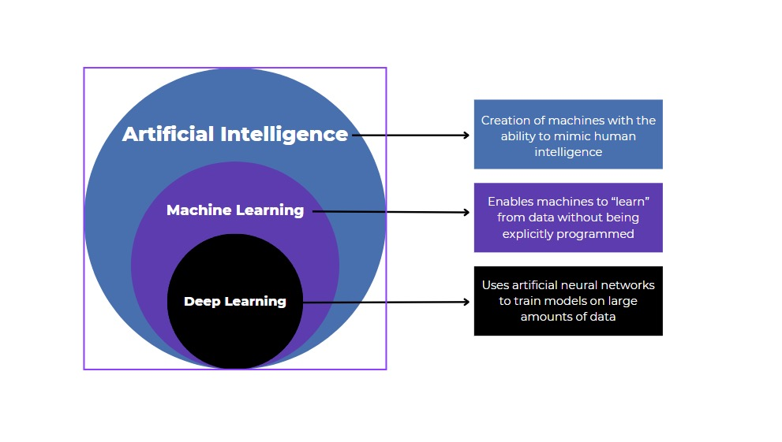

## AI vs ML Vs DL

## Main challenges of Machine Learning

* Overfitting
* Underfitting
* Insufficient amount of training data
* Non-representative data
* Data Mismatch
* Poor Quality of data

### Overfitting

It captures the unnnecessary patterns and noise from the training data due to high complexity of the model.
 
#### Example:
```
Imagine a model is trained to recognize cats from training data but it might learns very specific details like "background patterns" or "exact lightning".

Instead of learning cat features from the pictures.So it might well on training data but fail to generalize.
```

### Underfitting
It occurs when a model is too simple and didn't learn enough from the training data.So it performs poorly on both training and test sets.

#### Example:
```
In the same cat recognition scenario,if the model underfits it might only learn very basic details like shapes,colour etc.,and it fail to distinguish a cat from other animals. As a result it wont perform well even on training images.
```

### Insufficient amount of training data 
 Generally a model requires lot of data to learn effectively.If data is missing,biased, errors or insufficient the model will not perform well.

 #### Example:
 ```
 A self driving car trained only in sunny weather but it failed to perform in rain or snow.Because the training data didn't cover such situations.
 ```

 ### Non-Representative data
 The model which have enough training data ,but it won't represent entire training dataset (or) it is limited to certain scenarios .As a result It fails to generalize (or) recognize unseen (or) new data.

 #### Example:

 ```
  Imagine a model trained from the training data set of animals but it is only able to recognize cats and dogs, but unable to recognize other animals, because of non-representative data of animals training dataset.
  ```
  ### Poor Quality of data
  if a model has to be trained but it has errors (or) noise (or) redundancy (or) missing values in the training data set.

  #### Example:
  ```
  A weather prediction model trained on temperature data incorrectly will provide unreliable forecast data.
  ```
  
  # Supervised Learning
   The model can be trained based on labeled data and  based on that data it gives predictions.
  
   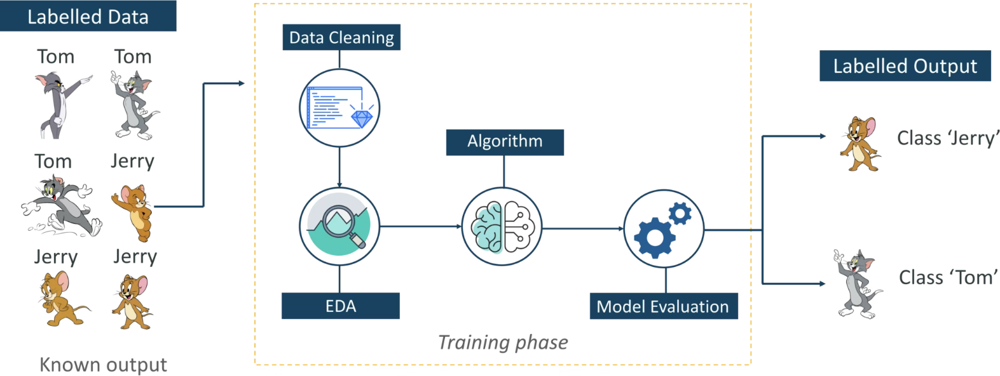
  
   The goal of supervised learning is to map input data to output data.
  
   It can be used to solve two types of problems.They are:
   * Classification
   * Regression
  
   #### Classification:
    Here the output is categorical variable.
  
   ##### Example:
    Email spam detection and Yes/no type problems.
  
    #### Regression:
    Here the output is continuous variable.
  
    ##### Example:
    Predicting house prices,stock prices etc.,
  
    ### Distance based models:
    * KNN model
    * K-Means
    * Hierarchial etc.,
  
    #### KNN model:
    * It is also known as K-Nearest neighbours model.
    * It is measured based on distance.
  
  ### Linear Models:
  These are statistical models where the relationship between dependent and independent variable is linear.
  ### Types of Linear models:
  * Linear Regression(for prediction of continuous variables)
  * Logistic Regression(for classification)
  
  ### Linear Regression:
  It is used to predict the dependent variable by using independent variable.
   * It makes predictions continuous numbers such as salary,age etc.,
  
   #### Formula:
   ```
   y= m0+mx+c;
  
   y= dependent variable
  
   m0 = intercept (when x=0,if there is no value mentioned for feature or at initial stage for y)
  
   m = no of times y value change for each unit change in x (or) steep of slope (or) rate of change.
  
   x= independent variable
  
   c = where the line cuts the y-axis.
   ```
   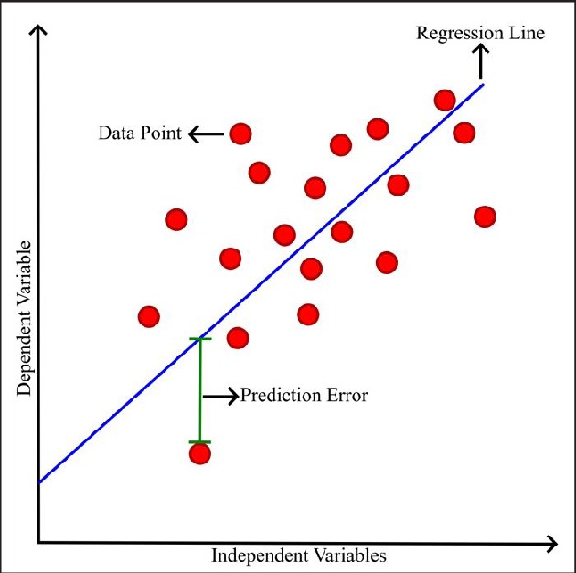

   #### Working:
  * Train the model to fit a best line between dependent and independent variables.
  * Minimize the errors by using mean squared error method.
  ```
  Mean Squared Error = average of squared differences between predicted and actual values
  ```
  #### Example:
  
  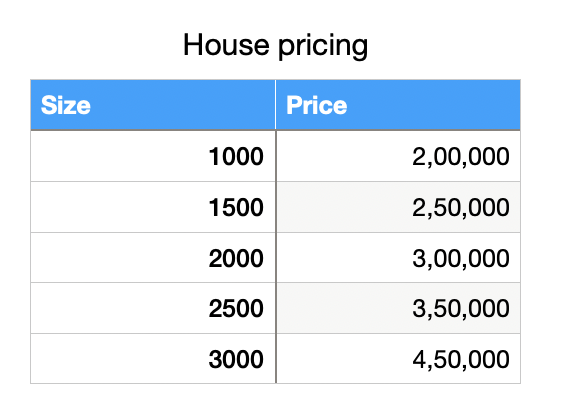
   If we want to predict the price of the house based on size(2200ft).
  
    ```
    y=m0+mx
  
    m0= base price
    m= price per foot
    y=target price of the house
    x= input feature 
    ```
  
  y = 1,00,000 + 100 * 2200 =$3,20,000 is the price of house for 2200 ft house.
  
  ### Logistic regression:
  * It is used for predicting the categorical variable using a given set of independent variables. 
  * It is a statistical model which is used to predict the binary outcome yes or no,0 or 1.
  * It is used for solving classification problems.
  
  
  
  * Instead of fitting a regression line ,here we fit sigmoid function.
  
  #### Sigmoid Function:
  It converts the values into the interval of 0 and 1.
  
  Formula:
  ```
   s = 1/1+e^-(z)
   ```
   where 
   ```
   z = mo+m1x+m2x+....+mnx
   ```
  * The value > 0.5 above threshold value considered as true or yes.
  * The value < 0.5 below the threshold value considered as false.
  
  Example:
  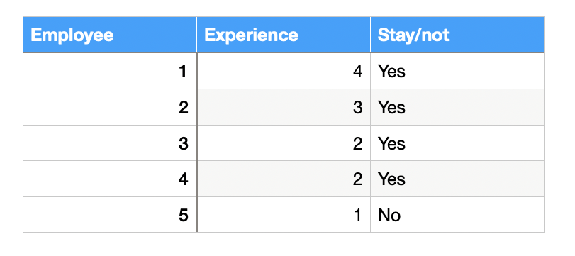
  * If we want to predict 5yrs whether to stay.
  * mo - initial point ,even if we keep -2 it will give low chance to stay.
  * when we apply the above if we take the values as:
  ```
  m0 = -2
  m1=5
  x = 5years 
  s =0.73 likely to stay.
  ```
  
  ### Types of Logistic Regression:
  
  
  ## Unsupervised Learning:
  * It is a technique to train the model with unlabeled data without any guidance.
  
  * It will find relationships between the input variables or group the similar data points.
   
  * There are two methods involved in this. They are:
  ```
  Clustering
  Association
  ```
  ## Clustering:
  Grouping of similar data points or the data points with same characteristics.
  
  Ex:K-means,KNN,DB scan ,Hierarchial clustering etc.,
  
  ### K-means:
  * Choose the no of clusters
  * Now choose centroids from the given dataset.
  * Now calculate euclidean distance from each centroid to every point.
  * Centroid to every point as cluster1.
  * Centroid2 to every point as second cluster.
  * Centroid3 to every point as third cluster.
  * After calculating ,assign data points to closest centroid.
  * Update the centroid like:
  ```
   p1+p2+p5/3 =c1
   p5+p6+p7+p9/4=c2
   p4+p8/2 =c3
   ```
   * Update like this until the clusters equal to new clusters or centroid in both columns.
  
   ### Limitations of K-means:
   #### Choosing the k-value manually
   * Choosing the k value manually which leads sometimes wrong predictions.
   #### Example:
   ```
    A company want to cluster the customer as segments based on spending habits if k means assumes it as 4 types where as there are 6 types ,it becomes inaccurate and affecting targeting ads.
   ```
  #### Works best with spherical shapes:
  * It assumes the clusters are in circular in shape it wont work well if the clusters are in different shape.
  #### Example:
  ```
  If u try to cluster a group in u shape,k means may split it into two groups
  ```
  #### Sensitive to outliers:
  
  * Just one very different data point can pull the centroid far away.
  
  #### Example:
  ```
  while analyzing bank transactions one customer might have a transaction of $100000,while others average have only 10000 ,this oulier leads the k means cluster the high value into wrong cluster.
  ```
  <!-- #### Cant detect noise
  * it wont detect noisy data or unnecessary data in clustering.
  Ex:
  ```
  If a want to cluster the similar spending habits customers into one group,even though the person is stranger k means assumes him as same group. -->
  <!-- ``` -->
  #### Intial centroids matter
  * K means assume to take random centroids at the initial phase,different starting points can give different results.
  #### Example:
  ````
  In image compression,It is used to reduce colors. if we initially bad colours it looks bad or look unnatural at final image.
  ````
  #### Struggles with varying densities:
  * if some clusters are dense and others are spread out it may not group them properly.
  #### Example:
  ```
  In a crowd management system at a stadium,if some sections are packed and some others are sparse.it may not correctly identify crowd density zones,which could mislead emergency teams.
  ```
  #### Works best with Numeric data
  It uses euclidean distance as a measure which doesnt work on text data.
  #### Example:
  ```
  In a survey of yes/no/maybe,k means can't calculate properly and unable to form clusters properly.
  ```
  #### Requires scaling of data:
  It is affected by large values.Features with large values can dominate the small values.
  #### Example:
  ```
  If in a health ,height is in cm and weight is in gms ,here it treat weight as high priority than height unless scaled properly.
  ```
  
  ### Clustering for image segmentation:
  #### Image Segmentation:
  Process of dividing an image into different parts or regions based on certain features like color,brightness or texture.
  #### Example:
  Group similar pixels like separating the sky,ground and people in a photo.
  
  #### Clustering:
  Grouping the similar pixels into one cluster.
  
  Examples: Sky,water and Person etc.,
  
  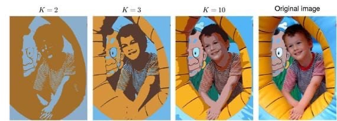
  
  #### Working:
  
  
  #### Read the image
  * The image is a grid of pixels.Each pixel has colour value.
  
  #### Example:
  ```
  Pixel 1: [255,0,0]-> Red
  Pixel 2: [0,255,0]-> Green
  ```
  Convert the image into pixels(data points).
  
  #### Choose a clustering algorithm:
  * K - means : Simple and fast
  * DBSCAN : can detect noise and unsual shapes.
  * Gausssian Mixtures Model: give soft clusters.
  
  #### Apply clustering:
  * if k =3,splitting the image into 3 parts.
  ##### K means will look at:
  * Look at each pixel colour
  * Group similar pixels into 3 clusters.
  * Assign a label to each pixel.
  
  So,
  ```
  Cluster 0 -> mostly sky pixels
  Cluster 1 -> grass
  Cluster 2 -> trees or objects
  ```
  #### Rebuild the image:
  * Each pixel is now part of a cluster.
  * Replace the each pixel with the average colour of its cluster.It gives you a new image with clear regions,where similar areas are coloured the same.
  
  Example 1:
  
  
  Example 2:
  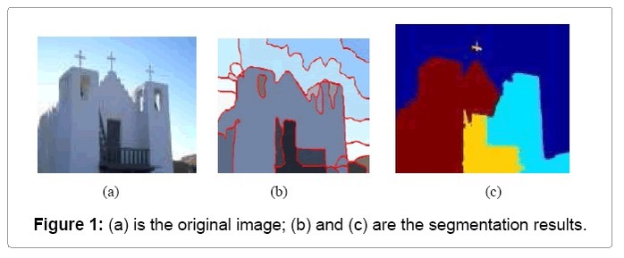
  
  Example:
  * If u take an image with:
  *  bug with red and black
  * leaf with green colour
  But if we take k = 2,it will segmented into two regions.
  * The segmented regions or clusters based on k value,
  ```
  if ,K=2 -> 2 colours,
      K=3 -> 3 colours etc.,
  ```
  #### Real time application:
  Face detection:
  * It is used to segment the facial regions(Skin,hair,Background)
  * if k =4,
  ```
  a.Skin
  b.Eyes
  c.Hair
  d.Background
  ```
  * Once skin-colored regions are identified,face shapes can be detected more easily.
  * This segmented data can be given to face recognition model to work more efficiently.
  #### Applications:
  ```
  * Tumour detection
  * Face Recognition,Traffic detection
  * Object detection and tracking
  * Satellite imaging
  ```
  ### Clustering for Preprocessing:
  * It means grouping similar points before feeding into a machine.
  * It helps in simplifying the data,detecting patterns or even removing noise.
  ### Reasons using clustering for preprocessing:
  #### Detect and remove outliers:
  * Algorithms like DBSCAN can find noisy data points and removing these outliers can remove the performance of classifiers and regressors.
  #### Example:
  A few wrongly entered student marks (999)can be removed.
  
  #### Feature Engineering:
  * we can use cluster labels as a new feature in data,it adds more info and helps to detect hidden patterns.
  #### Example:
  In a customer dataset clustering based on age and spending can add a customer type feature.
  
  #### Reduce data size:
  * If the dataset is huge,we can group of similar points with a single representative.
  
  #### Handle unlabeled data:
  * if you have no labels clustering can help generate pseudo-labels.It is useful in semi-supervised learning.
  
  #### Example:
  In medical data with no diagnosis,clustering might help group similar patterns.
  
  #### Improve data distribution
  * In imbalanced data clustering can help classes by oversampling or understanding subgroup structures.
  
  #### Example for CFP:
  * Suppose we have clustered image .
  * K - means clustering used to :
  ```
  separate the background colour.
  Reduce the no of colours 
  Highlight the important objects
  ```
  * Object detection or classification will be easier.
  
  #### Applications:
  * Image processing:
  ```
  Separate the background and main object before image classification.
  ```
  * Customer analysis:
  ```
  Groups the customers with similar buying behaviour before targeted marketing.
  ```
  * Medical diagnosis:
  ```
  Groups patients with similar symptoms for disease prediction.
  ```
  * Text mining:
  ```
  Groups articles or reviews with similar
  topics before analysis.
  ```
  ### Clustering for Semi-supevised learning:
  #### Semi-supervised learning:
  It is a type of machine learning using both labeled data and unlabeled data to train a model.
  * Labeled data: The input has a correct output.
  
  Ex: Photo of a cat labeled as cat.
  
  * Unlabeled data: The input has no labels.
  
  Ex: Photo with no label.
  
  #### Role of clustering in Semi-Supervised learning:
  * In semi-supervised,clustering is used to group unlabeled data based on the features(Like colour,size and shape).
  * Few labeled data points help us assign labels to entire clusters.This process is called label propagation.
  
  #### Steps:
  * Cluster the data(labeled and unlabeled).
  * Assign labels from known data to each cluster.
  * Train the model using the newly labeled dataset.
  
  #### Example:
  * 5 labeled images: 2 cats,2 dogs and 1 rabbit.
  * 1000 unlabeled images.
  #### how clustering helps:
  ```
  1.Use a clustering algorithm to group 1000 unlabeled images based on similarity(size,ears,colour).
  2.Then assign the known labels to clusters
  ex:If a cluster has few cats,label the rest of the cluster as cats.
  3.Now we have a bigger labeled dataset and the model becomes more accurate.
  ```
  
  #### Advantages:
  * Cheaper: Saves time and cost of manual labeling.
  
  * Smarter: Combines the best of supervised and unsupervised methods
  
  * Efficient: Works well when we have few labeled data and lot of unlabeled data.
  
  ##### Applications:
  * Face recogition: Few labeled faces,many unknown ones.
  
  * Email spam detection: Few labeled spam can help to identfy others.
  
  * Medical image diagnosis: Few labeled scans guide diagnosis for many images.
  
  ### Curse of Dimensionality
  * It refers to the problems and challenges that arises whe working with the high dimensional spaces.
  
  
  
  
  
  
  
  
  
  
   
  
  
  
    
  
  
  
   
  
  

     

## Ensemble learning
It is a machine learning technique to combine multiple models (weak learners) are trained to solve the same problem and then combined to get better results.

### Types of Ensemble learning:
* Bagging and Pasting
* Boosting
* Stacking

### Bagging:
It is a technique where the multiple copies of same model trained on different random subsets of training data(with replacement) and combine their outputs (voting or averaging)to make final predictions.

Ex: Random Forests

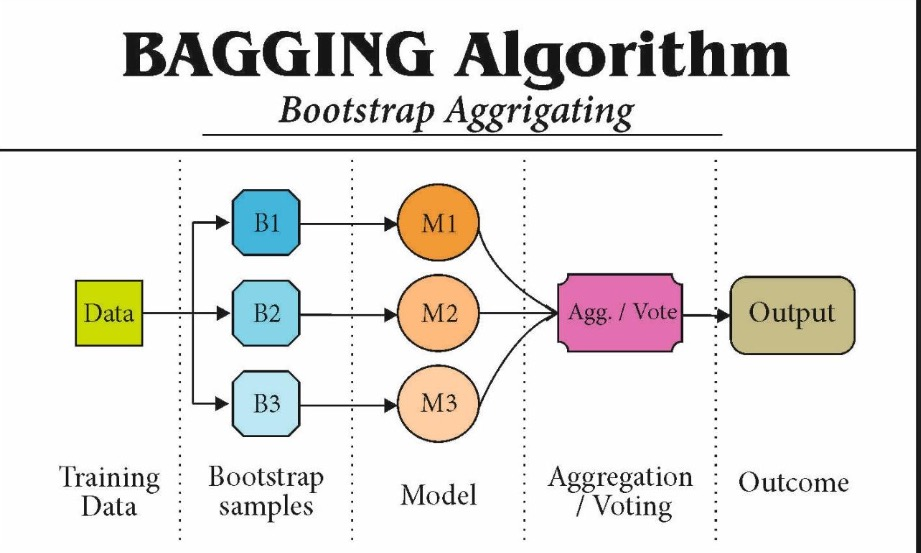

#### Models:
```
* KNN
* Decision Tree
* Naive baye's etc.,
```
It can be any model of multiple versions of that one.

#### Bootstrap samples (or) Bootstraping:
```
Creating random subsets of original dataset with replacement,maintaining same size as original dataset for each model.
```

#### Aggregation:
    Combining all the predictions 

#### Averaging:
    Combining all the predictions divided by no of predictions.

#### Voting:
    Taking the majority among the all predictions.

### Procedure:

* Create random subsets of original set or bootstrapping.
* Give each subset to each version of same model.
* The classifier will give the final prediction (or) output by taking all the predictions from each model based on the model requirements:
 ``` 
  Voting for classification.
  Averaging for regression.
```

### Note:
  * Averaging is used for regression
  * Voting is used for classification.
  * All averaging is aggregation,but not all aggregation is averaging.
  * Bagging reduces overfitting by combining all the weak learners.

### Pasting:
```
It is a method where the multiple versions of same model are trained on different random subsets of data set(without replacement) and combine their outputs(voting or averaging) to make final prediction.
```
### Random Forests
* It is nothing but collection of decision trees which are trained individually and combine to get final prediction.
* Each tree is trained separately.

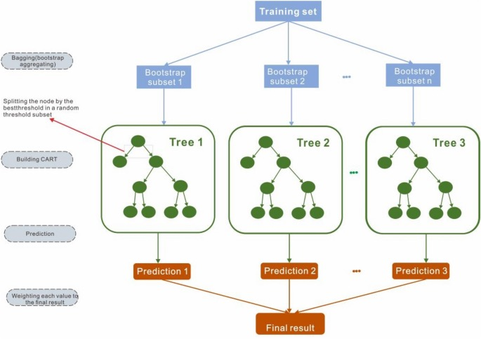
#### Algorithm:
```
1.Collect random subsets of original dataset.
2.The dataset samples are drawn with replacemet and same size of as original dataset.
3.Give each set of random data or features to each decision tree.
4.The decison trees will make predictions individually based on requirements.
5.Voting - For classification
Averaging - For regression.
```
* Here also the bootstrapping process can be done.
#### Example:
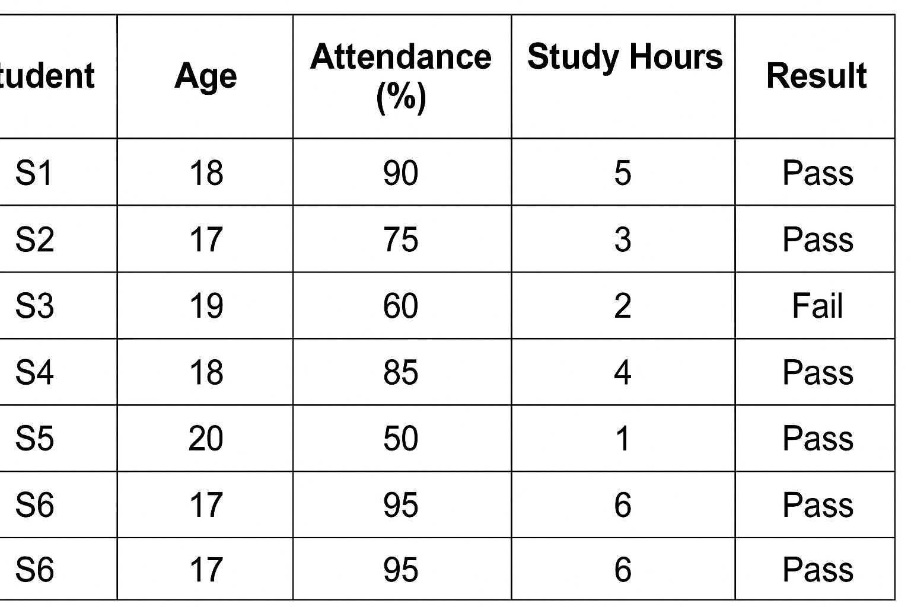

* Suppose we want to build 3 decision trees within the random forest.
* Our model is going to predict pass or fail on new student.
#### Step 1:
* Each decision tree takes random rows with replacement(same rows can be repeated).
* Tree1 : S1,S2,S4
* Tree2 : S2,S3,S5
* Tree3 :S3,S4,S6
#### Step 2:
* if the trees doesnt take all the data even though they will give the predictions for all students.
* when the tree is going to split ,for each split it will going to take 2 or 3 features not all(Age,Attendance,Study hours,Result)
#### Step 3:
* At first split(if attendance >80):
* Tree1:(Attendance,Study hours),Tree2:(Age,Marks),
Tree3:(Study hours,Marks)
* Next split trees will take again random features
#### Step 4:
* Each tree trained individually.
#### Step 5:
* For suppose,New student data appeared,the model going to predict the result:
* New student data:
```
Age:18
Attendance:80
Marks:65
Study hours:3
```
* Tree1:pass
* Tree2:pass
* Tree3:fail
#### Step 6:
* Here we will take the majority among the trees,So the student going to pass.

### Boosting:
 It is a technique where models are trained one after the other and each new model fixing the mistakes which are made by the previous one.

 * In,Ada boosting increasing weights to misclassified data and that data is given to new model to fix that data.

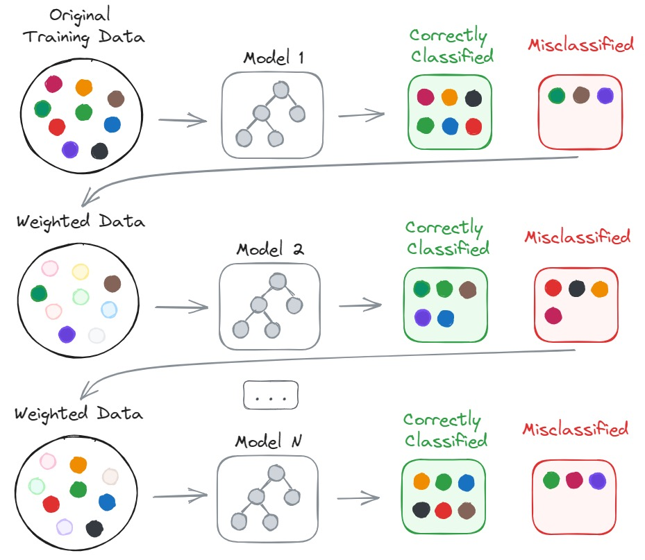

#### Algorithm:
* Start with a weak model and the total data has equal weights.
* Predict on training data and increase the weights to misclassified data .
* Weighted data is assigned to new model.
* Train the new model and again increase the weights to misclassified data.
* Again weighted data is assigned to new model,repeat this process.
* Combine all the outputs to get the final prediction.

#### Note:
```
We will assign weights to incorrect data in ada boost,in normal boosting we will just give importance to misclassified data and give that data to new model
```
### Types of Boosting:
* Ada boosting
* Gradient boosting
* XGboosting

### Gradient boosting:
* Here we use gradient function to minimize the errors in the data instead of assigning weights to misclassified data.

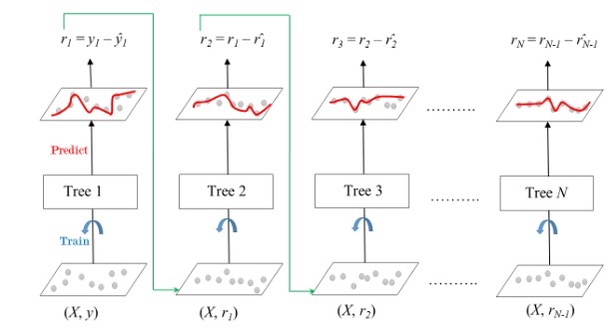

#### Algorithm:
* First train the trees and predict using training data.
* After predictions we will get some values which are probable 
* Calculate residuals
```
Residuals = Actual value - Predicted value(probable)
```
* Give the residuals to the next model to get the second model prediction .
* Also calculate the second residual.
* Now calculate the final prediction.
* By updating the first prediction to get more accurate results which are nearer to actual values.
```
Final Prediction = First model prediction + second model residual
```
Example:
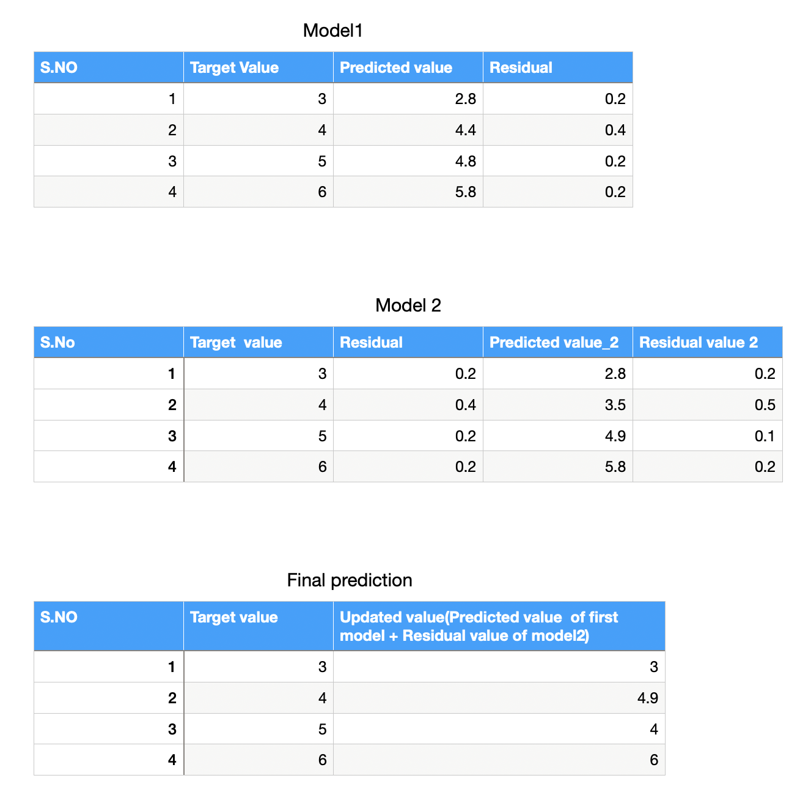

#### XG boosting:


  
 
