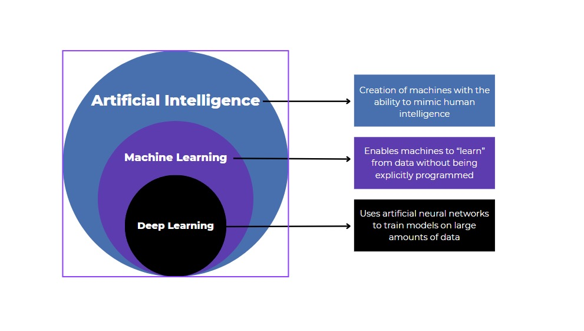

# Machine Learning
## Artificial Intelligence
  Creation of machines which mitigates (or) mimics the human intelligence.

##  Machine Learning
   It is a subset of AI which is used to train machine by feeding large amount of data without explicit programming.

## Deep learning
 It is a subset of AI and ML which uses artificial neural networks to train model with huge amount of data.



## AI vs ML Vs DL

## Main challenges of Machine Learning

* Overfitting
* Underfitting
* Insufficient amount of training data
* Non-representative data
* Data Mismatch
* Poor Quality of data

### Overfitting

It captures the unnnecessary patterns and noise from the training data due to high complexity of the model.
 
#### Example:
```
Imagine a model is trained to recognize cats from training data but it might learns very specific details like "background patterns" or "exact lightning".

Instead of learning cat features from the pictures.So it might well on training data but fail to generalize.
```

### Underfitting
It occurs when a model is too simple and didn't learn enough from the training data.So it performs poorly on both training and test sets.

#### Example:
```
In the same cat recognition scenario,if the model underfits it might only learn very basic details like shapes,colour etc.,and it fail to distinguish a cat from other animals. As a result it wont perform well even on training images.
```

### Insufficient amount of training data 
 Generally a model requires lot of data to learn effectively.If data is missing,biased, errors or insufficient the model will not perform well.

 #### Example:
 ```
 A self driving car trained only in sunny weather but it failed to perform in rain or snow.Because the training data didn't cover such situations.
 ```

 ### Non-Representative data
 The model which have enough training data ,but it won't represent entire training dataset (or) it is limited to certain scenarios .As a result It fails to generalize (or) recognize unseen (or) new data.

 #### Example:

 ```
  Imagine a model trained from the training data set of animals but it is only able to recognize cats and dogs, but unable to recognize other animals, because of non-representative data of animals training dataset.
  ```
  ### Poor Quality of data
  if a model has to be trained but it has errors (or) noise (or) redundancy (or) missing values in the training data set.

  #### Example:
  ```
  A weather prediction model trained on temperature data incorrectly will provide unreliable forecast data.
  ```
  

     


