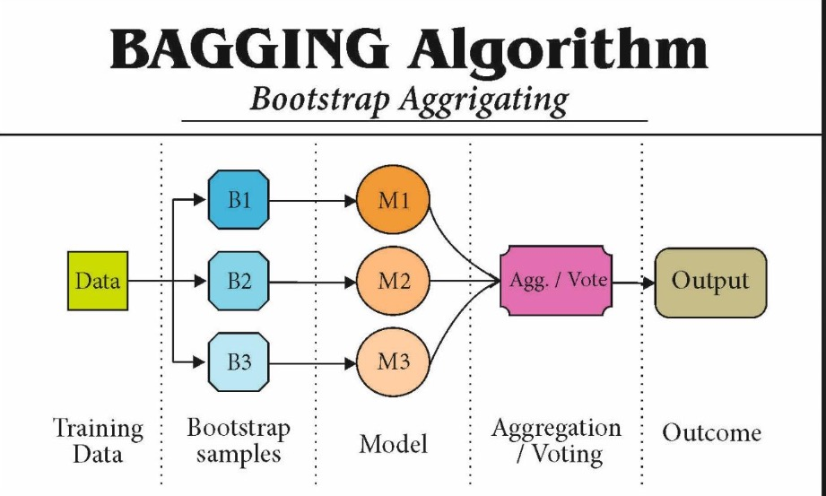
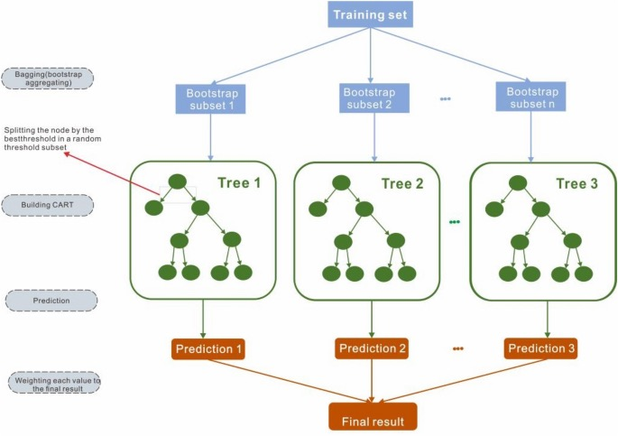
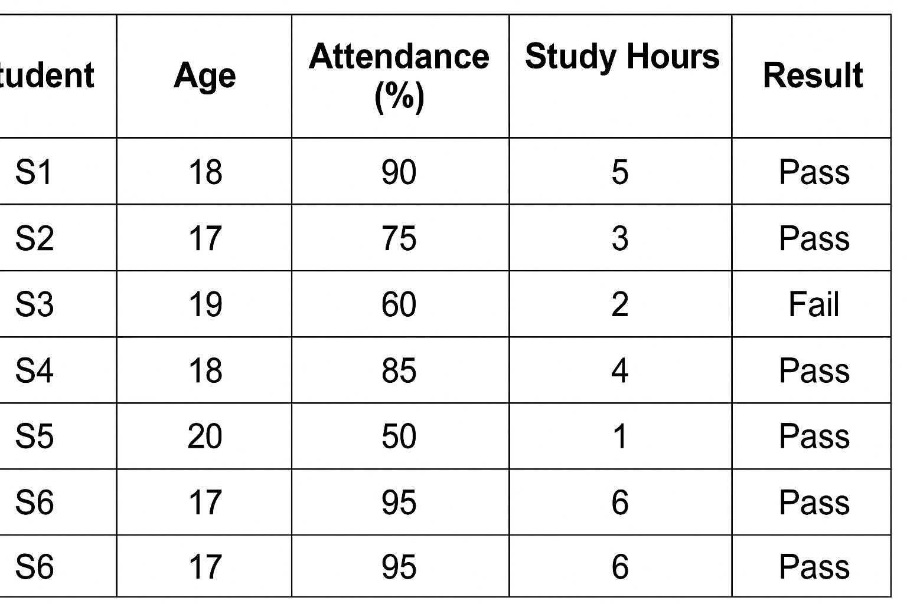
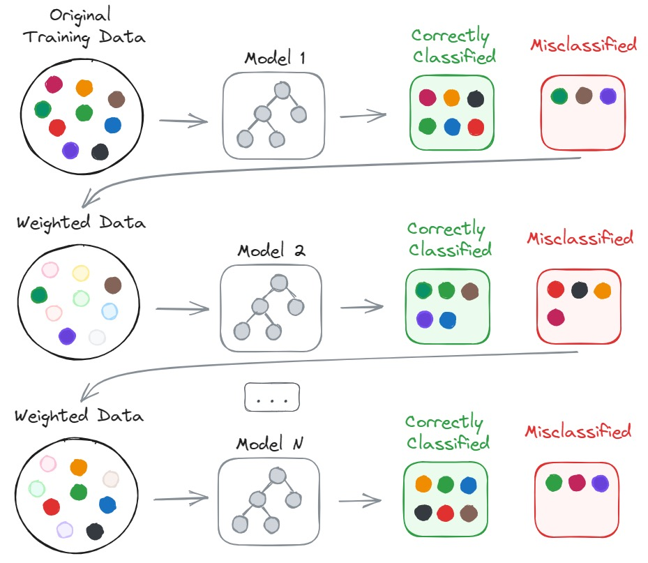
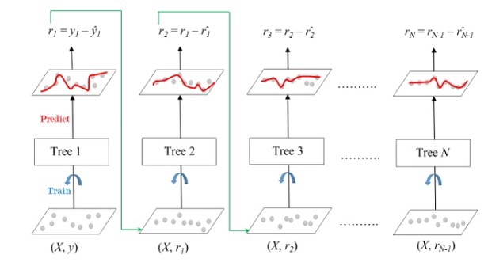
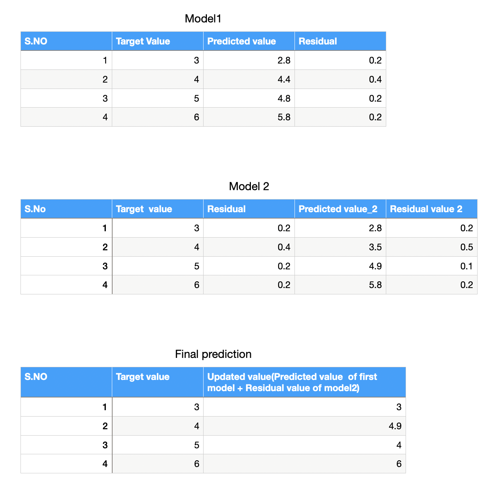

## Ensemble learning
It is a machine learning technique to combine multiple models (weak learners) are trained to solve the same problem and then combined to get better results.

### Types of Ensemble learning:
* Bagging and Pasting
* Boosting
* Stacking

### Bagging:
It is a technique where the multiple copies of same model trained on different random subsets of training data(with replacement) and combine their outputs (voting or averaging)to make final predictions.

Ex: Random Forests



#### Models:
```
* KNN
* Decision Tree
* Naive baye's etc.,
```
It can be any model of multiple versions of that one.

#### Bootstrap samples (or) Bootstraping:
```
Creating random subsets of original dataset with replacement,maintaining same size as original dataset for each model.
```

#### Aggregation:
    Combining all the predictions 

#### Averaging:
    Combining all the predictions divided by no of predictions.

#### Voting:
    Taking the majority among the all predictions.

### Procedure:

* Create random subsets of original set or bootstrapping.
* Give each subset to each version of same model.
* The classifier will give the final prediction (or) output by taking all the predictions from each model based on the model requirements:
 ``` 
  Voting for classification.
  Averaging for regression.
```

### Note:
  * Averaging is used for regression
  * Voting is used for classification.
  * All averaging is aggregation,but not all aggregation is averaging.
  * Bagging reduces overfitting by combining all the weak learners.

### Pasting:
```
It is a method where the multiple versions of same model are trained on different random subsets of data set(without replacement) and combine their outputs(voting or averaging) to make final prediction.
```
### Random Forests
* It is nothing but collection of decision trees which are trained individually and combine to get final prediction.
* Each tree is trained separately.


#### Algorithm:
```
1.Collect random subsets of original dataset.
2.The dataset samples are drawn with replacemet and same size of as original dataset.
3.Give each set of random data or features to each decision tree.
4.The decison trees will make predictions individually based on requirements.
5.Voting - For classification
Averaging - For regression.
```
* Here also the bootstrapping process can be done.
#### Example:


* Suppose we want to build 3 decision trees within the random forest.
* Our model is going to predict pass or fail on new student.
#### Step 1:
* Each decision tree takes random rows with replacement(same rows can be repeated).
* Tree1 : S1,S2,S4
* Tree2 : S2,S3,S5
* Tree3 :S3,S4,S6
#### Step 2:
* if the trees doesnt take all the data even though they will give the predictions for all students.
* when the tree is going to split ,for each split it will going to take 2 or 3 features not all(Age,Attendance,Study hours,Result)
#### Step 3:
* At first split(if attendance >80):
* Tree1:(Attendance,Study hours),Tree2:(Age,Marks),
Tree3:(Study hours,Marks)
* Next split trees will take again random features
#### Step 4:
* Each tree trained individually.
#### Step 5:
* For suppose,New student data appeared,the model going to predict the result:
* New student data:
```
Age:18
Attendance:80
Marks:65
Study hours:3
```
* Tree1:pass
* Tree2:pass
* Tree3:fail
#### Step 6:
* Here we will take the majority among the trees,So the student going to pass.

### Boosting:
 It is a technique where models are trained one after the other and each new model fixing the mistakes which are made by the previous one.

 * In,Ada boosting increasing weights to misclassified data and that data is given to new model to fix that data.



#### Algorithm:
* Start with a weak model and the total data has equal weights.
* Predict on training data and increase the weights to misclassified data .
* Weighted data is assigned to new model.
* Train the new model and again increase the weights to misclassified data.
* Again weighted data is assigned to new model,repeat this process.
* Combine all the outputs to get the final prediction.

#### Note:
```
We will assign weights to incorrect data in ada boost,in normal boosting we will just give importance to misclassified data and give that data to new model
```
### Types of Boosting:
* Ada boosting
* Gradient boosting
* XGboosting

### Gradient boosting:
* Here we use gradient function to minimize the errors in the data instead of assigning weights to misclassified data.



#### Algorithm:
* First train the trees and predict using training data.
* After predictions we will get some values which are probable 
* Calculate residuals
```
Residuals = Actual value - Predicted value(probable)
```
* Give the residuals to the next model to get the second model prediction .
* Also calculate the second residual.
* Now calculate the final prediction.
* By updating the first prediction to get more accurate results which are nearer to actual values.
```
Final Prediction = First model prediction + second model residual
```
Example:


#### XG boosting:


  
 