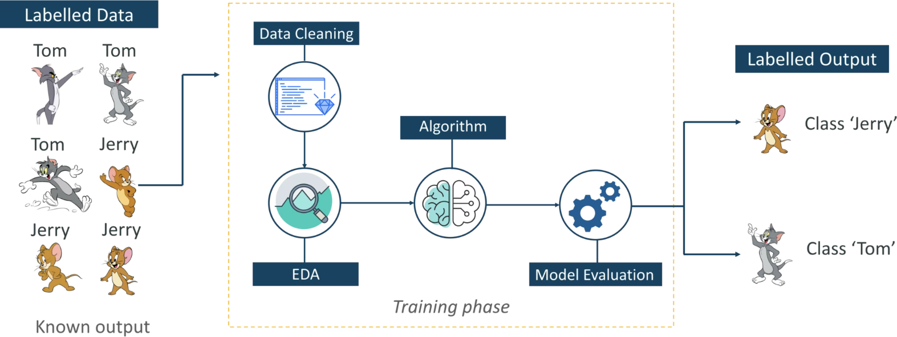
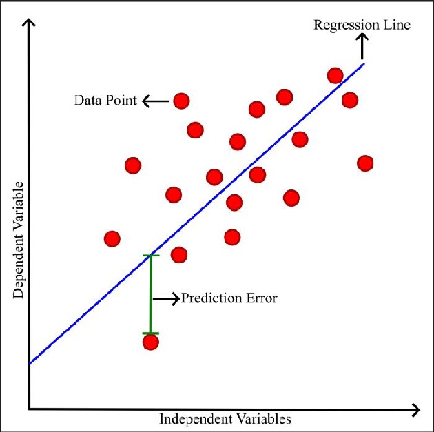
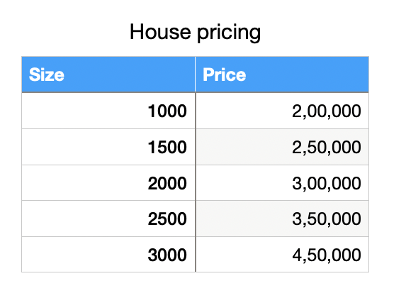
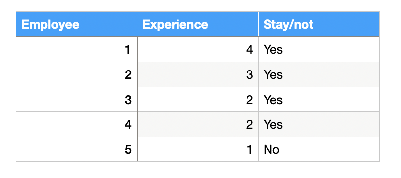

# Supervised Learning
 The model can be trained based on labeled data and  based on that data it gives predictions.

 

 The goal of supervised learning is to map input data to output data.

 It can be used to solve two types of problems.They are:
 * Classification
 * Regression

 #### Classification:
  Here the output is categorical variable.

 ##### Example:
  Email spam detection and Yes/no type problems.

  #### Regression:
  Here the output is continuous variable.

  ##### Example:
  Predicting house prices,stock prices etc.,

  ### Distance based models:
  * KNN model
  * K-Means
  * Hierarchial etc.,

  #### KNN model:
  * It is also known as K-Nearest neighbours model.
  * It is measured based on distance.

### Linear Models:
These are statistical models where the relationship between dependent and independent variable is linear.
### Types of Linear models:
* Linear Regression(for prediction of continuous variables)
* Logistic Regression(for classification)

### Linear Regression:
It is used to predict the dependent variable by using independent variable.
 * It makes predictions continuous numbers such as salary,age etc.,

 #### Formula:
 ```
 y= m0+mx+c;

 y= dependent variable

 m0 = intercept (when x=0,if there is no value mentioned for feature or at initial stage for y)

 m = no of times y value change for each unit change in x (or) steep of slope (or) rate of change.

 x= independent variable

 c = where the line cuts the y-axis.
 ```
 
 #### Working:
* Train the model to fit a best line between dependent and independent variables.
* Minimize the errors by using mean squared error method.
```
Mean Squared Error = average of squared differences between predicted and actual values
```
#### Example:


 If we want to predict the price of the house based on size(2200ft).

  ```
  y=m0+mx

  m0= base price
  m= price per foot
  y=target price of the house
  x= input feature 
  ```

y = 1,00,000 + 100 * 2200 =$3,20,000 is the price of house for 2200 ft house.

### Logistic regression:
* It is used for predicting the categorical variable using a given set of independent variables. 
* It is a statistical model which is used to predict the binary outcome yes or no,0 or 1.
* It is used for solving classification problems.


* Instead of fitting a regression line ,here we fit sigmoid function.

#### Sigmoid Function:
It converts the values into the interval of 0 and 1.

Formula:
```
 s = 1/1+e^-(z)
 ```
 where 
 ```
 z = mo+m1x+m2x+....+mnx
 ```
* The value > 0.5 above threshold value considered as true or yes.
* The value < 0.5 below the threshold value considered as false.

Example:

* If we want to predict 5yrs whether to stay.
* mo - initial point ,even if we keep -2 it will give low chance to stay.
* when we apply the above if we take the values as:
```
m0 = -2
m1=5
x = 5years 
s =0.73 likely to stay.
```

### Types of Logistic Regression:


 


  


 

