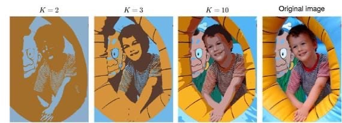
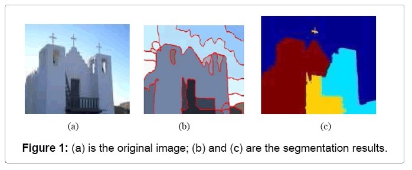

## Unsupervised Learning:
* It is a technique to train the model with unlabeled data without any guidance.

* It will find relationships between the input variables or group the similar data points.
 
* There are two methods involved in this. They are:
```
Clustering
Association
```
## Clustering:
Grouping of similar data points or the data points with same characteristics.

Ex:K-means,KNN,DB scan ,Hierarchial clustering etc.,

### K-means:
* Choose the no of clusters
* Now choose centroids from the given dataset.
* Now calculate euclidean distance from each centroid to every point.
* Centroid to every point as cluster1.
* Centroid2 to every point as second cluster.
* Centroid3 to every point as third cluster.
* After calculating ,assign data points to closest centroid.
* Update the centroid like:
```
 p1+p2+p5/3 =c1
 p5+p6+p7+p9/4=c2
 p4+p8/2 =c3
 ```
 * Update like this until the clusters equal to new clusters or centroid in both columns.

 ### Limitations of K-means:
 #### Choosing the k-value manually
 * Choosing the k value manually which leads sometimes wrong predictions.
 #### Example:
 ```
  A company want to cluster the customer as segments based on spending habits if k means assumes it as 4 types where as there are 6 types ,it becomes inaccurate and affecting targeting ads.
 ```
#### Works best with spherical shapes:
* It assumes the clusters are in circular in shape it wont work well if the clusters are in different shape.
#### Example:
```
If u try to cluster a group in u shape,k means may split it into two groups
```
#### Sensitive to outliers:

* Just one very different data point can pull the centroid far away.

#### Example:
```
while analyzing bank transactions one customer might have a transaction of $100000,while others average have only 10000 ,this oulier leads the k means cluster the high value into wrong cluster.
```
<!-- #### Cant detect noise
* it wont detect noisy data or unnecessary data in clustering.
Ex:
```
If a want to cluster the similar spending habits customers into one group,even though the person is stranger k means assumes him as same group. -->
<!-- ``` -->
#### Intial centroids matter
* K means assume to take random centroids at the initial phase,different starting points can give different results.
#### Example:
````
In image compression,It is used to reduce colors. if we initially bad colours it looks bad or look unnatural at final image.
````
#### Struggles with varying densities:
* if some clusters are dense and others are spread out it may not group them properly.
#### Example:
```
In a crowd management system at a stadium,if some sections are packed and some others are sparse.it may not correctly identify crowd density zones,which could mislead emergency teams.
```
#### Works best with Numeric data
It uses euclidean distance as a measure which doesnt work on text data.
#### Example:
```
In a survey of yes/no/maybe,k means can't calculate properly and unable to form clusters properly.
```
#### Requires scaling of data:
It is affected by large values.Features with large values can dominate the small values.
#### Example:
```
If in a health ,height is in cm and weight is in gms ,here it treat weight as high priority than height unless scaled properly.
```

### Clustering for image segmentation:
#### Image Segmentation:
Process of dividing an image into different parts or regions based on certain features like color,brightness or texture.
#### Example:
Group similar pixels like separating the sky,ground and people in a photo.

#### Clustering:
Grouping the similar pixels into one cluster.

Examples: Sky,water and Person etc.,



#### Working:


#### Read the image
* The image is a grid of pixels.Each pixel has colour value.

#### Example:
```
Pixel 1: [255,0,0]-> Red
Pixel 2: [0,255,0]-> Green
```
Convert the image into pixels(data points).

#### Choose a clustering algorithm:
* K - means : Simple and fast
* DBSCAN : can detect noise and unsual shapes.
* Gausssian Mixtures Model: give soft clusters.

#### Apply clustering:
* if k =3,splitting the image into 3 parts.
##### K means will look at:
* Look at each pixel colour
* Group similar pixels into 3 clusters.
* Assign a label to each pixel.

So,
```
Cluster 0 -> mostly sky pixels
Cluster 1 -> grass
Cluster 2 -> trees or objects
```
#### Rebuild the image:
* Each pixel is now part of a cluster.
* Replace the each pixel with the average colour of its cluster.It gives you a new image with clear regions,where similar areas are coloured the same.

Example 1:


Example 2:


Example:
* If u take an image with:
*  bug with red and black
* leaf with green colour
But if we take k = 2,it will segmented into two regions.
* The segmented regions or clusters based on k value,
```
if ,K=2 -> 2 colours,
    K=3 -> 3 colours etc.,
```
#### Real time application:
Face detection:
* It is used to segment the facial regions(Skin,hair,Background)
* if k =4,
```
a.Skin
b.Eyes
c.Hair
d.Background
```
* Once skin-colored regions are identified,face shapes can be detected more easily.
* This segmented data can be given to face recognition model to work more efficiently.
#### Applications:
```
* Tumour detection
* Face Recognition,Traffic detection
* Object detection and tracking
* Satellite imaging
```
### Clustering for Preprocessing:
* It means grouping similar points before feeding into a machine.
* It helps in simplifying the data,detecting patterns or even removing noise.
### Reasons using clustering for preprocessing:
#### Detect and remove outliers:
* Algorithms like DBSCAN can find noisy data points and removing these outliers can remove the performance of classifiers and regressors.
#### Example:
A few wrongly entered student marks (999)can be removed.

#### Feature Engineering:
* we can use cluster labels as a new feature in data,it adds more info and helps to detect hidden patterns.
#### Example:
In a customer dataset clustering based on age and spending can add a customer type feature.

#### Reduce data size:
* If the dataset is huge,we can group of similar points with a single representative.

#### Handle unlabeled data:
* if you have no labels clustering can help generate pseudo-labels.It is useful in semi-supervised learning.

#### Example:
In medical data with no diagnosis,clustering might help group similar patterns.

#### Improve data distribution
* In imbalanced data clustering can help classes by oversampling or understanding subgroup structures.

#### Example for CFP:
* Suppose we have clustered image .
* K - means clustering used to :
```
separate the background colour.
Reduce the no of colours 
Highlight the important objects
```
* Object detection or classification will be easier.

#### Applications:
* Image processing:
```
Separate the background and main object before image classification.
```
* Customer analysis:
```
Groups the customers with similar buying behaviour before targeted marketing.
```
* Medical diagnosis:
```
Groups patients with similar symptoms for disease prediction.
```
* Text mining:
```
Groups articles or reviews with similar
topics before analysis.
```
### Clustering for Semi-supevised learning:
#### Semi-supervised learning:
It is a type of machine learning using both labeled data and unlabeled data to train a model.
* Labeled data: The input has a correct output.

Ex: Photo of a cat labeled as cat.

* Unlabeled data: The input has no labels.

Ex: Photo with no label.

#### Role of clustering in Semi-Supervised learning:
* In semi-supervised,clustering is used to group unlabeled data based on the features(Like colour,size and shape).
* Few labeled data points help us assign labels to entire clusters.This process is called label propagation.

#### Steps:
* Cluster the data(labeled and unlabeled).
* Assign labels from known data to each cluster.
* Train the model using the newly labeled dataset.

#### Example:
* 5 labeled images: 2 cats,2 dogs and 1 rabbit.
* 1000 unlabeled images.
#### how clustering helps:
```
1.Use a clustering algorithm to group 1000 unlabeled images based on similarity(size,ears,colour).
2.Then assign the known labels to clusters
ex:If a cluster has few cats,label the rest of the cluster as cats.
3.Now we have a bigger labeled dataset and the model becomes more accurate.
```

#### Advantages:
* Cheaper: Saves time and cost of manual labeling.

* Smarter: Combines the best of supervised and unsupervised methods

* Efficient: Works well when we have few labeled data and lot of unlabeled data.

##### Applications:
* Face recogition: Few labeled faces,many unknown ones.

* Email spam detection: Few labeled spam can help to identfy others.

* Medical image diagnosis: Few labeled scans guide diagnosis for many images.

### Curse of Dimensionality
* It refers to the problems and challenges that arises whe working with the high dimensional spaces.


